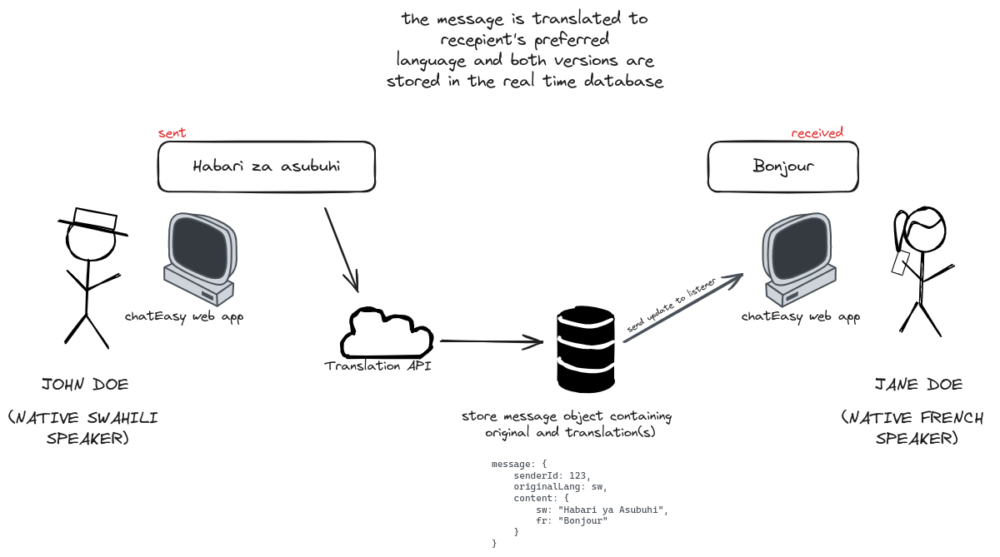
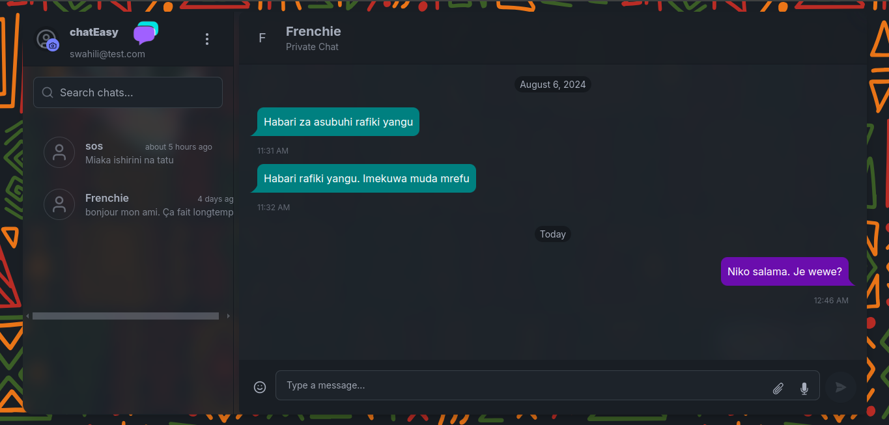
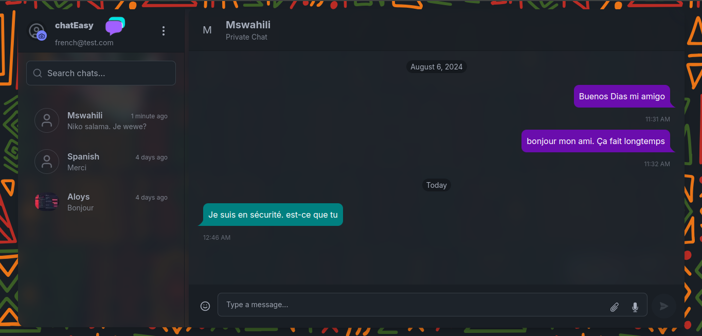

# <p align = "center"> 🌍✨ chatEasy 🌍✨  </p>

Welcome to **chatEasy**, the instant messaging application designed to break down language barriers and bring friends from different corners of the world closer together. With real-time translation for messages and UI elements, chatEasy ensures a seamless communication experience where language is no longer a hurdle.

# 📜 Purpose

The purpose of chatEasy is to allow users from different nations to communicate effortlessly. By abstracting the translation process, users can send messages and interact with the application in their native language while receiving responses in a language they understand. This fosters genuine connections and friendships across diverse linguistic backgrounds.

# 🏗️ Structure
The project follows a standard Next.js application structure with additional directories for firebase integration and organization:
```bash
/project-nimbus
├── app
│   ├── android-chrome-192x192.png
│   ├── android-chrome-512x512.png
│   ├── api
│   │   ├── auth
│   │   │   └── [...nextauth]
│   │   │       └── route.ts
│   │   └── search-users
│   │       └── route.ts
│   ├── apple-touch-icon.png
│   ├── assets
│   │   └── img
│   │       ├── g-icon.png
│   │       ├── icon.svg
│   │       ├── jane.png
│   │       ├── john.png
│   │       ├── logo-dark.png
│   │       ├── logo-light.png
│   │       ├── phone-chat.png
│   │       ├── wallpaper-dark.svg
│   │       └── wallpaper-light.svg
│   ├── (auth)
│   │   ├── signin
│   │   │   └── page.tsx
│   │   └── signup
│   │       └── page.tsx
│   ├── chat
│   │   └── page.tsx
│   ├── favicon-16x16.png
│   ├── favicon-32x32.png
│   ├── favicon.ico
│   ├── globals.css
│   ├── (invitation)
│   │   ├── accept-invite
│   │   │   └── page.tsx
│   │   └── invite
│   │       └── page.tsx
│   ├── layout.tsx
│   ├── page.tsx
│   └── site.webmanifest
├── components
│   ├── ActionButton.tsx
│   ├── AuthCard.tsx
│   ├── AvatarUpload.tsx
│   ├── BlockButton.tsx
│   ├── ChatHeader.tsx
│   ├── ChatItem.tsx
│   ├── ChatList.tsx
│   ├── ChatRoom.tsx
│   ├── CombinedChatPage.tsx
│   ├── common
│   │   ├── ChatIllustration.tsx
│   │   ├── Dropdown.tsx
│   │   └── Logo.tsx
│   ├── CreateNewChat.tsx
│   ├── EmojiPicker.tsx
│   ├── ErrorAlert.tsx
│   ├── InputField.tsx
│   ├── InvitationCard.tsx
│   ├── LoadingSpinner.tsx
│   ├── MessageInput.tsx
│   ├── MessageList.tsx
│   ├── PasswordField.tsx
│   ├── PreferredLanguageSelect.tsx
│   ├── SearchBar.tsx
│   ├── SessionProvider.tsx
│   ├── StatusMessage.tsx
│   ├── ThemeProvider.tsx
│   ├── ThemeSwitcher.tsx
│   ├── TranslucentCard.tsx
│   ├── UserDetailsSidebar.tsx
│   ├── UserInfo.tsx
│   └── UserProfile.tsx
├── constants
│   └── index.ts
├── lib
│   ├── auth.ts
│   ├── email.ts
│   ├── firebaseAdmin.ts
│   ├── firebaseClient.ts
│   ├── firebaseStorage.ts
│   └── upload.ts
├── next.config.js
├── next.config.mjs
├── package.json
├── package-lock.json
├── postcss.config.mjs
├── README.md
├── store
│   ├── useChatStore.ts
│   └── useUserStore.ts
├── tailwind.config.ts
├── tsconfig.json
└── types
    ├── index.ts
    └── next-auth.d.ts
```

- **app**
Main application directory with source code.

- **api**: Contains server-side routes, including authentication and user search APIs utilizing Firebase.
(auth): Pages for sign-in and sign-up.
chat/page.tsx: Chat interface for real-time messaging with Firebase.

- **components**
Reusable UI components for the application, such as ChatHeader, MessageList, and EmojiPicker, all designed to interact with Firebase for data handling.

- **lib**
Utility functions and Firebase configurations:

- **firebaseAdmin.ts, firebaseClient.ts**: 
Manage server and client-side Firebase interactions.

- **store**
State management for chat and user data, leveraging Firebase for real-time updates.

- **types**
Type definitions for TypeScript, including those for Firebase and authentication.

- **Root Files**
Configuration files for Next.js and Firebase setup, including package.json and tailwind.config.ts for styling.

We are currently utilizing Firebase for real-time chat functionality and user authentication, ensuring a clean and scalable codebase.


Please note that the project structure may change as development is ongoing. Always refer to the most recent version of the project for the accurate structure.

# 🔧 How We Solve the Problem

chatEasy tackles the language barrier challenge with these innovative solutions:

1) **Real-Time Translation**: Messages are instantly translated as they are sent and received, ensuring smooth communication without delays.

2) **Localized UI**: The application interface adapts to the user's preferred language, making it intuitive and user-friendly.

3) **Seamless Integration**: The translation service is seamlessly integrated into the backend, abstracting the complexity from the end-user.
   
By leveraging cutting-edge AI and machine learning technologies, chatEasy provides an experience where users can interact as if they are speaking the same language, regardless of their geographical and linguistic differences.


## How it Works


A sample of out tentative user interface:




This is a [Next.js](https://nextjs.org/) project bootstrapped with [`create-next-app`](https://github.com/vercel/next.js/tree/canary/packages/create-next-app).

# AI Life Cycle

## Swahili-English Translation Model Fine-Tuning and Deployment

## Overview
This overview documents the process of fine-tuning and training a Swahili-English translation model. The model was fine-tuned and trained four times on a Google Cloud Platform (GCP) notebook instance, utilizing a Virtual Machine (VM) with 8 vCPUs and 32 GB of RAM. After completing the training, the model was successfully deployed on Hugging Face for public use.


## Training Environment
- **Platform:** Google Cloud Platform (GCP)
- **Instance Type:** Compute Engine VM
- **vCPUs:** 8
- **RAM:** 32 GB
- **Notebook Instance:** GCP AI Platform Notebooks

## Training Process

### Dataset Preparation
- Collected and preprocessed a dataset of Swahili-English text pairs for training.
- Used standard text preprocessing techniques such as tokenization, padding, and cleaning of the dataset to ensure high-quality input.


### Model Selection
- Chose a pre-trained transformer-based model suitable for translation tasks.
- The base model was selected for its effectiveness in low-resource language pairs.


### Fine-Tuning
- Fine-tuned the model on the Swahili-English dataset in four iterations.
- Adjusted hyperparameters such as learning rate, batch size, and epochs to optimize performance.
- Utilized the GCP VM with 8 vCPUs and 32 GB RAM for efficient processing during training.


### Deployment
- Once the final iteration was completed, the model was exported and prepared for deployment.
- The model was then uploaded and deployed on Hugging Face's model hub.

## Deployment Link
The fine-tuned Swahili-English translation model is publicly available on Hugging Face and can be accessed through the following link:


[Swahili-English Translation Model on Hugging Face](https://huggingface.co/Bildad/Swahili-English_Translation)

## Usage
To use the model, you can either download it from Hugging Face or use the Inference API provided on the Hugging Face model page. Below is a sample Python code snippet for using the model via the Hugging Face Transformers library:

```python
from transformers import AutoTokenizer, AutoModelForSeq2SeqLM

# Load the model and tokenizer
tokenizer = AutoTokenizer.from_pretrained("Bildad/Swahili-English_Translation")
model = AutoModelForSeq2SeqLM.from_pretrained("Bildad/Swahili-English_Translation")

# Sample translation
input_text = "Habari, unafanyaje?"
inputs = tokenizer(input_text, return_tensors="pt")
outputs = model.generate(**inputs)
translated_text = tokenizer.decode(outputs[0], skip_special_tokens=True)

print(f"Translated text: {translated_text}")
```
## Getting Started on using the App

To run the chateasy application locally:

1. Install dependencies
```bash
npm install
```
2. create a .env file and populate it with your firebase credentials as follows
```bash
#From Firebase Console
NEXT_PUBLIC_FIREBASE_API_KEY=
NEXT_PUBLIC_FIREBASE_AUTH_DOMAIN=
NEXT_PUBLIC_FIREBASE_PROJECT_ID=
NEXT_PUBLIC_FIREBASE_STORAGE_BUCKET=
NEXT_PUBLIC_FIREBASE_MESSAGING_SENDER_ID=
NEXT_PUBLIC_FIREBASE_APP_ID=


#For Google Translate API
NEXT_PUBLIC_GOOGLE_TRANSLATE_API_KEY=<GET AN API KEY FROM GOOGLE CLOUD CONSOLE>
NEXT_PUBLIC_GOOGLE_TRANSLATE_API_URL=https://translation.googleapis.com/language/translate/v2

```
3. Run the development server
```bash
npm run dev
```

Open [http://localhost:3000](http://localhost:3000) with your browser to see the result.

You can start editing the page by modifying `app/page.tsx`. The page auto-updates as you edit the file.

This project uses [`next/font`](https://nextjs.org/docs/basic-features/font-optimization) to automatically optimize and load Inter, a custom Google Font.

## Learn More

To learn more about Next.js, take a look at the following resources:

- [Next.js Documentation](https://nextjs.org/docs) - learn about Next.js features and API.
- [Learn Next.js](https://nextjs.org/learn) - an interactive Next.js tutorial.

You can check out [the Next.js GitHub repository](https://github.com/vercel/next.js/) - your feedback and contributions are welcome!

## Deploy on Vercel

The easiest way to deploy your Next.js app is to use the [Vercel Platform](https://vercel.com/new?utm_medium=default-template&filter=next.js&utm_source=create-next-app&utm_campaign=create-next-app-readme) from the creators of Next.js.

Check out our [Next.js deployment documentation](https://nextjs.org/docs/deployment) for more details.
